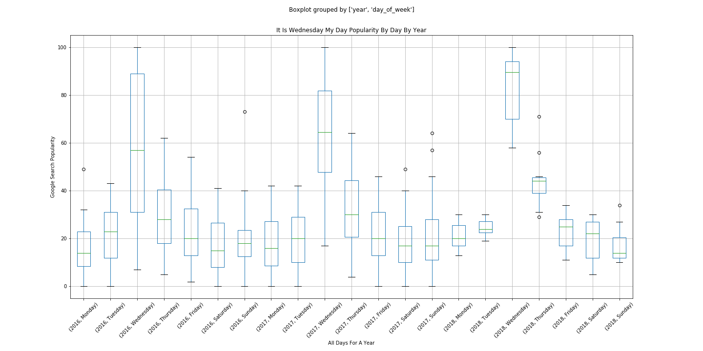

# "It Is Wednesday My Dude"

I should have named this project "Is It Wednesday My Dude". First off, if you're unfamiliar with the phrase

> "It Is Wednesday My Dude"

take a look at [this](http://knowyourmeme.com/memes/it-is-wednesday-my-dudes) link so the context of this will make more sense. One morning I was looking at a Wednesday meme when I started wondering if you could use the search results paterns of people googling for the weekly meme, to determine if it was Wednesday. I've wanted to use the [Google Trends](https://trends.google.com/trends) website for quite a while, as I believe it can be an incredibly powerful tool to look at what's popular around the world. I came up with a question:

> Can one determine it is Wednesday, based purely on the number of times someone looks up this meme

I was able to fetch the data from Google Trends](https://trends.google.com/trends) and created a basic box-and-whisker plot for each day of the week, aggregated, since the inception of the meme.  

You can see above, that of the three years of data, the Wednesday are clearly more popular for this search term. If we were graph the trend, you'd see interest growing to Wednesday, peaking and diving back down.

This was a pretty goofy project, but was a neat way to demonstrate using [Google Trends](https://trends.google.com/trends) to represent popularity.